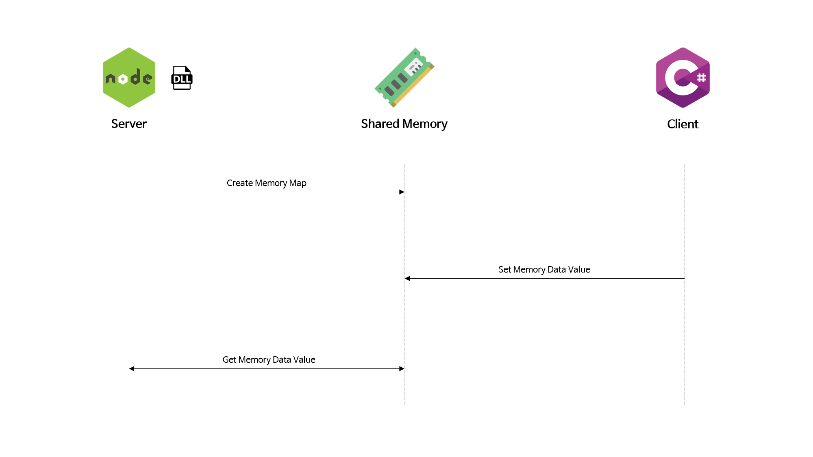

<h1>node.js 공유 메모리 사용</h1>

<h2>🎨 Flow</h2>

<h2>🛠 Tools</h2>

  
  
  

<h2>🍀 Skills</h2>

  
  
  

<h2>📚 Description</h2>

  edgejs 모듈을 사용하여 dll 파일을 nodejs에서 실행할 수 있습니다. 
  따라서, nodejs에서 직접적인 메모리 접근은 이루어지지 않으며 dll 호출을 통한 접근이 가능합니다.
  dll 파일의 특정 메소드에서 결과값을 리턴 받을 수 있습니다.

